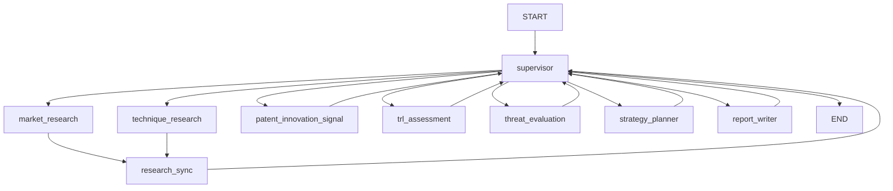

# Subject
Semiconductor Strategy Workflow

## Abstract
반도체 기술 전략 분석을 위해 시장 조사, 기술 조사, 특허/혁신 신호 분석, TRL 판정, 위협 평가, 전략 수립, 보고서 생성을 하나의 LangGraph 워크플로우로 연결한 프로젝트입니다.  
내부 PDF 자료와 외부 웹 조사 결과를 함께 사용해 기술별 전략 인사이트를 생성하고, 최종 결과를 Markdown, HTML, PDF 형태의 보고서로 출력합니다.

## Overview
- Objective : 반도체 기술(HBM4, PIM, CXL 등)에 대해 시장성, 기술 성숙도, 경쟁 위협, 실행 전략을 통합 분석하는 자동화 워크플로우를 구축
- Method : LangGraph 기반 멀티 에이전트 구조로 supervisor 시작 라우팅, 초기 조사(시장/기술), RAG 검색, LLM 기반 판단, 규칙 기반 fallback을 결합
- Tools : Internal PDF RAG(BM25 + optional dense retrieval), WebSearchClient(SerpAPI / OpenAlex)

## Features
- PDF 자료 기반 정보 추출
- 웹 조사와 내부 RAG를 결합한 증거 수집
- Supervisor가 초기 시장/기술 조사 단계를 라우팅
- 특허 및 혁신 신호 기반 간접 경쟁력 분석
- TRL(Technology Readiness Level) 자동 판정
- 경쟁 위협 수준 평가 및 기술별 전략 추천
- Markdown, HTML, PDF 보고서 자동 생성
- 확증 편향 방지 전략 : confirming / opposing / objective query를 분리한 balanced search plan을 사용하고, supervisor 및 validation node를 통해 근거 편향을 점검

## Tech Stack

| Category   | Details |
|------------|---------|
| Framework  | LangGraph, Python |
| LLM        | GPT-4o-mini via OpenAI API |
| Retrieval  | BM25-based RAG with optional dense retrieval |
| Embedding  | intfloat/multilingual-e5-large-instruct |
| Parsing    | PyPDF |
| Output     | Markdown, HTML, PDF |

## Agents

- `MarketResearchCollectorAgent`: 시장/경쟁사/사업화 리스크 조사
- `TechniqueResearchCollectorAgent`: 기술 원리, 병목, 표준, 리스크 조사
- `PatentInnovationSignalAgent`: 특허, 논문, 웹 기반 혁신 신호 분석
- `TRLAssessmentAgent`: TRL 규칙과 근거 기반 기술 성숙도 판정
- `ThreatEvaluationAgent`: TRL 및 간접 신호를 바탕으로 경쟁 위협 수준 평가
- `StrategyPlannerAgent`: 기술별 우선순위와 실행 전략 도출
- `ReportWriterAgent`: 최종 보고서 생성
- `SupervisorAgent`: 각 단계 검토 및 그래프 라우팅

## Agent Tools

- `MarketResearchCollectorAgent`: `WebSearchClient`로 시장/기업 기사 검색, 내부 `RAG` 코퍼스로 기업·시장 근거 보강
- `TechniqueResearchCollectorAgent`: `RAG`로 기술/표준 PDF 검색, `WebSearchClient`의 OpenAlex·웹 검색으로 논문/리스크 검증
- `PatentInnovationSignalAgent`: `SerpAPI` Google Patents 검색, `OpenAlex` 논문 검색, 일반 웹 검색, 실패 시 내부 `RAG` fallback
- `TRLAssessmentAgent`: 내부 `TRL` 코퍼스 검색, 시장/기술/특허 evidence 종합, `OpenAI structured output` 기반 TRL 판정 fallback 포함
- `ThreatEvaluationAgent`: `OpenAI structured output` 또는 규칙 기반 로직으로 위협 수준 평가
- `StrategyPlannerAgent`: `OpenAI structured output` 또는 규칙 기반 로직으로 전략 추천 생성
- `ReportWriterAgent`: Markdown/HTML 생성 후 `write_html_pdf` 또는 `write_simple_pdf`로 보고서 출력
- `SupervisorAgent`: `SupervisorLLMReviewer`와 validation rule로 단계별 재시도 여부와 다음 노드 라우팅 결정

## Architecture



## Directory Structure

```text
├── reference/                     # PDF 문서 (research / trl)
├── src/semiconductor_agent/       # 핵심 워크플로우 코드
│   ├── agent_nodes/               # 각 Agent 모듈
│   ├── workflow/                  # LangGraph 빌더 및 팀 구성
│   ├── rag.py                     # RAG / 검색 로직
│   ├── search.py                  # 웹 검색 및 balanced search
│   ├── runtime.py                 # 환경 변수 / runtime 설정
│   ├── state.py                   # AgentState 정의
│   └── shared_standards.py        # TRL 규칙 및 공통 기준
├── outputs/                       # 보고서 및 실행 결과 저장
├── tests/                         # 테스트 코드
├── main.py                        # 실행 스크립트
├── run.sh                         # 빠른 실행 스크립트
└── README.md
```

## Execution

### Quick Start

```bash
./run.sh
```

```bash
./run.sh "HBM4, PIM, CXL 기술 전략을 분석해줘"
```

### Python Run

```bash
PYTHONPATH=src python3 main.py --query "HBM4, PIM, CXL 기술 전략을 분석해줘"
```

```bash
PYTHONPATH=src python3 main.py \
  --query "HBM4, PIM, CXL 기술 전략을 분석해줘" \
  --output ./outputs/custom_run \
  --verbose
```

### Install

```bash
python3 -m venv .venv
source .venv/bin/activate
pip install -r requirements.txt
```

## Contributors
- 김지성: 아키텍처 설계, Trl, Threat, Strategy Agent 구현
- 박진: 아키텍처 설계, Market Search Agent, Technique Search Agent 구현
- 심유정: 아키텍처 설계, Report Agent, Patent Search Agent 구현
- 이소율: 아키텍처 설계
