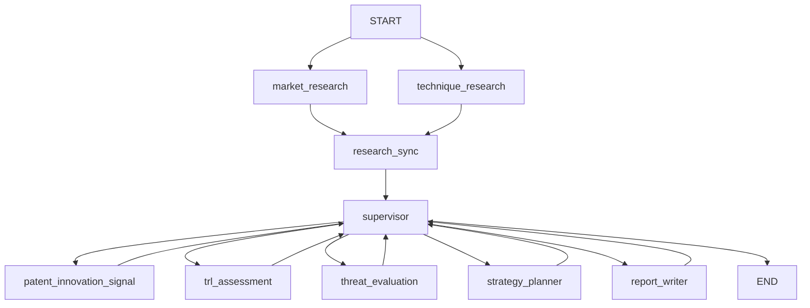

# Semiconductor Strategy Workflow

반도체 기술 전략 분석을 위한 LangGraph 기반 멀티 에이전트 워크플로우입니다.  
시장 조사, 기술 조사, 특허/혁신 신호, TRL 판정, 위협 평가, 전략 수립, 보고서 생성을 하나의 그래프로 연결해 실행합니다.

## 개요

이 프로젝트는 다음 흐름을 자동화합니다.

- 시장 조사와 기술 조사를 병렬로 수행
- 특허 및 혁신 신호를 수집
- TRL(Technology Readiness Level)을 판정
- 경쟁 위협 수준을 평가
- 기술별 전략을 도출
- Markdown, HTML, PDF 보고서를 생성

보고서 결과물은 기본적으로 `outputs/` 아래에 생성됩니다.

- `semiconductor_strategy_report.md`
- `semiconductor_strategy_report.html`
- `semiconductor_strategy_report.pdf`
- `workflow_result.json`

## 그래프 아키텍처

구현 기준 그래프는 [`workflow/builder.py`](/Users/jin/workspace/ai_mini_pj/ai-mini-project/src/semiconductor_agent/workflow/builder.py), [`workflow/team.py`](/Users/jin/workspace/ai_mini_pj/ai-mini-project/src/semiconductor_agent/workflow/team.py) 에 정의되어 있습니다.



### 노드 설명

- `market_research`
  - 시장/경쟁사/사업화 리스크를 조사합니다.
  - 현재 구현은 웹 조사 비중을 높여 `웹 70% / RAG 30%` 수준으로 evidence를 구성합니다.
- `technique_research`
  - 기술 원리, 병목, 표준, 위험 요소를 조사합니다.
  - 마찬가지로 `웹 70% / RAG 30%` 비중으로 evidence를 구성합니다.
- `research_sync`
  - 병렬 조사 두 갈래가 끝난 뒤 supervisor로 합류시키는 동기화 노드입니다.
- `supervisor`
  - 현재 단계 산출물을 검토하고 다음 노드를 라우팅합니다.
  - 필요 시 재시도 흐름도 제어합니다.
- `patent_innovation_signal`
  - 특허, 논문, 웹 신호를 바탕으로 간접 혁신 신호를 정리합니다.
- `trl_assessment`
  - 시장/기술/특허 신호와 내부 TRL 규칙을 바탕으로 TRL을 판정합니다.
  - OpenAI 사용 시 회사-기술 조합별 LLM 판정을 병렬 실행할 수 있습니다.
- `threat_evaluation`
  - TRL 결과와 특허/생태계 신호를 바탕으로 위협 수준을 평가합니다.
  - OpenAI API 키가 있으면 LLM 기반 평가를 사용하고, 없으면 규칙 기반으로 fallback 됩니다.
- `strategy_planner`
  - 기술별 우선순위와 실행 전략을 도출합니다.
  - OpenAI API 키가 있으면 LLM 기반 전략 생성을 사용하고, 없으면 규칙 기반으로 fallback 됩니다.
- `report_writer`
  - 최종 보고서를 Markdown/HTML/PDF로 생성합니다.
  - 보고서는 `OVERVIEW` 섹션으로 시작합니다.

## 디렉터리 구조

```text
.
├── main.py
├── run.sh
├── requirements.txt
├── pyproject.toml
├── reference/
│   ├── research/
│   └── trl/
├── src/semiconductor_agent/
│   ├── agent_nodes/
│   │   ├── market.py
│   │   ├── technique.py
│   │   ├── patent.py
│   │   ├── trl.py
│   │   ├── threat.py
│   │   ├── strategy.py
│   │   ├── report.py
│   │   └── supervisor.py
│   ├── workflow/
│   │   ├── builder.py
│   │   ├── team.py
│   │   ├── dependencies.py
│   │   └── review.py
│   ├── rag.py
│   ├── search.py
│   ├── runtime.py
│   ├── state.py
│   └── shared_standards.py
└── tests/
```

## 설치

Python 3.9 이상을 권장합니다.

```bash
python3 -m venv .venv
source .venv/bin/activate
pip install -r requirements.txt
```

`langgraph`, `langchain-openai`, `pydantic`, `pypdf`, `sentence-transformers`가 기본 의존성입니다.

## 실행 방법

### 1. 빠른 실행

```bash
./run.sh
```

질문을 직접 넘기려면:

```bash
./run.sh "HBM4, PIM, CXL 기술 전략을 분석해줘"
```

### 2. Python 엔트리포인트 실행

```bash
PYTHONPATH=src python3 main.py --query "HBM4, PIM, CXL 기술 전략을 분석해줘"
```

출력 디렉터리를 직접 지정하려면:

```bash
PYTHONPATH=src python3 main.py \
  --query "HBM4, PIM, CXL 기술 전략을 분석해줘" \
  --output ./outputs/custom_run
```

자세한 에러 로그를 보려면:

```bash
PYTHONPATH=src python3 main.py --query "HBM4 분석" --verbose
```

## 환경 변수

환경 변수는 프로젝트 루트의 `.env` 파일에 둘 수 있고, [`runtime.py`](/Users/jin/workspace/ai_mini_pj/ai-mini-project/src/semiconductor_agent/runtime.py)에서 자동으로 읽습니다.

### 주요 옵션

- `OPENAI_API_KEY`
  - OpenAI 기반 TRL, threat, strategy, supervisor review를 사용할 때 필요합니다.
- `OPENAI_MODEL`
  - 기본값은 `gpt-4o-mini`
- `ENABLE_WEB_SEARCH`
  - `true`로 설정하면 웹 검색을 사용합니다.
- `ENABLE_DENSE_RAG`
  - 기본값은 `false`
  - CPU 환경에서 무거운 임베딩 모델 로딩을 피하기 위해 기본적으로 dense RAG는 꺼져 있습니다.
- `USE_LLM_PLANNING`
  - 검색 계획 생성에 LLM을 사용할지 제어합니다.
- `USE_LLM_SUPERVISOR_REVIEW`
  - supervisor의 LLM 기반 리뷰 사용 여부를 제어합니다.
- `OUTPUT_DIR`
  - 기본 출력 경로를 바꿉니다.
- `RESEARCH_REFERENCE_DIR`
  - `reference/research` 대신 다른 연구 자료 디렉터리를 사용합니다.
- `TRL_REFERENCE_DIR`
  - `reference/trl` 대신 다른 TRL 자료 디렉터리를 사용합니다.
- `TRL_LLM_MAX_WORKERS`
  - TRL LLM 병렬 판정 시 최대 worker 수를 제어합니다.

예시:

```env
OPENAI_API_KEY=sk-...
OPENAI_MODEL=gpt-4o-mini
ENABLE_WEB_SEARCH=true
ENABLE_DENSE_RAG=false
USE_LLM_SUPERVISOR_REVIEW=true
TRL_LLM_MAX_WORKERS=4
```

## RAG / 검색 동작

- `reference/research`: 기술/시장 관련 내부 PDF 자료
- `reference/trl`: TRL 판정 보조 자료
- 기본 dense RAG는 꺼져 있고, BM25 기반 검색이 기본입니다.
- 웹 검색이 활성화되면 시장 조사와 기술 조사에서 웹 비중을 더 높게 반영합니다.

## 테스트

기본 테스트 실행:

```bash
PYTHONPATH=src python3 -m unittest discover -s tests -v
```

설치가 안 된 의존성이 있으면 import 단계에서 실패할 수 있습니다. 먼저 `pip install -r requirements.txt`를 마친 뒤 실행하는 것을 권장합니다.

## 참고 사항

- OpenAI API 키가 없어도 fallback 로직으로 대부분의 워크플로우는 실행되도록 설계되어 있습니다.
- 다만 `ENABLE_WEB_SEARCH`, OpenAI 기반 판단, 외부 API 기반 특허/검색 품질은 환경 변수 설정 여부에 영향을 받습니다.
- 현재 보고서는 `OVERVIEW`로 시작하며, 전략 요약이 상단에 함께 들어갑니다.
